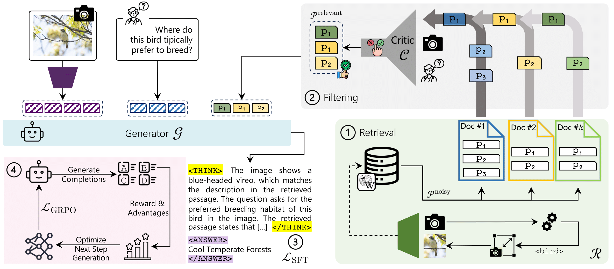

<div align="center">
  <h1> ReAG: Reasoning-Augmented Generation for Knowledge-based Visual Question Answering </h1>
</div>

<div align="center">
  
[-f9f107.svg)](https://cvpr.thecvf.com/virtual/2026/poster/37311)
[](https://arxiv.org/abs/2511.22715)
[](https://aimagelab.github.io/ReAG/)
[](https://huggingface.co/collections/aimagelab/reag)
</div>

<p align="center">
  
</p>

## 📢 Latest Updates
  - [2026/04/24] 🤗 Inference code and **weights** release
  - [2026/04/09] 🌟 ReAG has been selected as **Highlight**
  - [2026/02/21] 📚 ReAG has been **accepted @ CVPR 2026**

## Overview

ReAG is a Reasoning-Augmented Multimodal RAG approach for Knowledge-based VQA. Standard retrieval-augmented methods often retrieve noisy or irrelevant passages, limiting answer quality. ReAG addresses this by combining coarse- and fine-grained retrieval with a critic model that filters out low-quality passages before answer generation. The model is trained with a multi-stage strategy: a supervised fine-tuning as a cold start, followed by reinforcement learning to promote explicit reasoning grounded in retrieved evidence. ReAG significantly outperforms prior methods on Encyclopedic-VQA and InfoSeek.

This repository contains the inference pipeline for **ReAG: Reasoning-Augmented Generation for Knowledge-based Visual Question Answering (KB-VQA)**. The model checkpoints are hosted **on Hugging Face**:

- **ReAG Generator 3B**: https://huggingface.co/aimagelab/ReAG-3B
- **ReAG Generator 7B**: https://huggingface.co/aimagelab/ReAG-7B
- **ReAG Critic**: https://huggingface.co/aimagelab/ReAG-Critic

## Table of Contents

- [Environment Setup](#environment-setup)
  - [Inference environment](#1-create-the-inference-environment-venv)
  - [EVQA evaluation environment](#2-create-the-evqa-evaluation-environment-evqa-eval)
- [Datasets](#datasets)
  - [Infoseek](#infoseek)
  - [Encyclopedic-VQA](#encyclopedic-vqa)
- [Knowledge Bases and FAISS Indexes](#knowledge-bases-and-faiss-indexes)
- [Inference](#inference)
  - [Slurm (optional)](#slurm-optional)
  - [What the scripts do](#what-the-scripts-do)
- [Outputs](#outputs)
- [Citation](#citation)


## Environment Setup
The following code was tested using:

- Python 3.11
- CUDA 12.6 (for GPU inference)

We use two separate environments:

1. `.venv` — main inference environment (PyTorch + Transformers)
2. `evqa-eval` — EVQA evaluation environment (TensorFlow stack), kept separate due to TF/PyTorch conflicts

### 1) Create the inference environment

```bash
python3.11 -m venv .venv
source .venv/bin/activate

python -m pip install --upgrade pip

# Example: Torch wheels for CUDA 12.6
python -m pip install torch==2.6.0+cu126 torchvision==0.21.0+cu126 torchaudio==2.6.0+cu126 \
  --index-url https://download.pytorch.org/whl/cu126

# Install remaining dependencies
python -m pip install -r requirements.txt
```

If you use `conda`, you can install the packages from [requirements.txt](requirements.txt) in an activated conda environment.

### 2) Create the EVQA evaluation environment

This environment is only needed to run the EVQA evaluation scripts. TensorFlow dependencies conflicts with the main inference stack, so we kept it separate.

```bash
python3.11 -m venv evqa_eval/.venv
source evqa_eval/.venv/bin/activate

python -m pip install --upgrade pip
python -m pip install -r src/retrieval_module/evqa_eval/requirements.txt
```

## Datasets
 
We provide pre-packaged evaluation data for both benchmarks so you can get started quickly without navigating the original dataset repositories.
 
### Infoseek
 
Download the evaluation data for Infoseek [here](https://ailb-web.ing.unimore.it/publicfiles/drive/reflectiva/data_infoseek.zip). For the full dataset, refer to the [official repository](https://github.com/open-vision-language/infoseek).
 
The inference scripts expect Infoseek in JSONL format (`--query_path` points to a `.jsonl` file).
 
### Encyclopedic-VQA
 
Download the evaluation data for Encyclopedic-VQA [here](https://ailb-web.ing.unimore.it/publicfiles/drive/reflectiva/data_evqa.zip), and the evaluation images [here](https://ailb-web.ing.unimore.it/publicfiles/drive/reflectiva/evqa_inference_images.zip). For the full dataset, refer to the [official repository](https://github.com/google-research/google-research/tree/master/encyclopedic_vqa).
 
The inference scripts expect EVQA in JSON format (`--query_path` points to a `.json` file).
 
## Knowledge Bases and FAISS Indexes
 
Our work uses two knowledge bases, one per benchmark. To enhance reproducibility, we provide both the knowledge bases and the pre-built FAISS indexes for the best configuration presented in the paper. Embeddings are generated using the [EVA-CLIP](https://huggingface.co/BAAI/EVA-CLIP-8B) model.
 
- **Infoseek** — index available [here](https://ailb-web.ing.unimore.it/publicfiles/drive/reflectiva/index/infoseek_EVA_text_summary.zip)
- **Encyclopedic-VQA** — index available [here](https://ailb-web.ing.unimore.it/publicfiles/drive/reflectiva/index/evqa_EVA_image.zip)

## Inference

Once datasets and indexes are in place, unzip all archives and update the paths in the `.sh` scripts to match your local filesystem. We provide two ready-to-use scripts:

- EVQA: [retrieval_evqa.sh](src/retrieval_module/retrieval_evqa.sh)
- Infoseek: [retrieval_infoseek.sh](src/retrieval_module/retrieval_infoseek.sh)

These scripts are written as Slurm jobs. For local runs, remove the Slurm directives and `srun` prefix while keeping the rest of the command unchanged.

### Slurm (optional)

If you are on an HPC cluster with SLURM, submit the scripts directly after editing the asset paths:

```bash
sbatch retrieval_evqa.sh
sbatch retrieval_infoseek.sh
```

### What the scripts do

Both scripts invoke [retrieval.py](src/retrieval_module/retrieval.py) with a common set of flags representing the **full end-to-end ReAG pipeline**:

- `--model_name "aimagelab/ReAG-3B"`
- `--top_k 20`
- `--force_reasoning` + `--extract_reasoning`
- `--crop_query_img`
- `--critic_model_name "aimagelab/ReAG-Critic"`
- ` --eval_passages` + `--yes_prob_thr 0.1`

You can freely add or remove flags inside the `.sh` files to configure your experiment. Notable options include:

- `--few_shots` — Infoseek few-shot prompting
- `--eval_passages` — critic-based passage filtering
- `--use_google_lens` or `--use_oracle` — EVQA retrieval variants

## Outputs

Results are written under the `--output_root` directory. The script automatically constructs an experiment folder name based on the dataset, model, retrieval setup, and active flags.

## Citation

If you use this code, please cite our CVPR 2026 paper:

```bibtex
@article{compagnoni2025reag,
  title={ReAG: Reasoning-Augmented Generation for Knowledge-based Visual Question Answering},
  author={Compagnoni, Alberto and Morini, Marco and Sarto, Sara and Cocchi, Federico and Caffagni, Davide and Cornia, Marcella and Baraldi, Lorenzo and Cucchiara, Rita},
  journal={arXiv preprint arXiv:2511.22715},
  year={2025}
}
```
